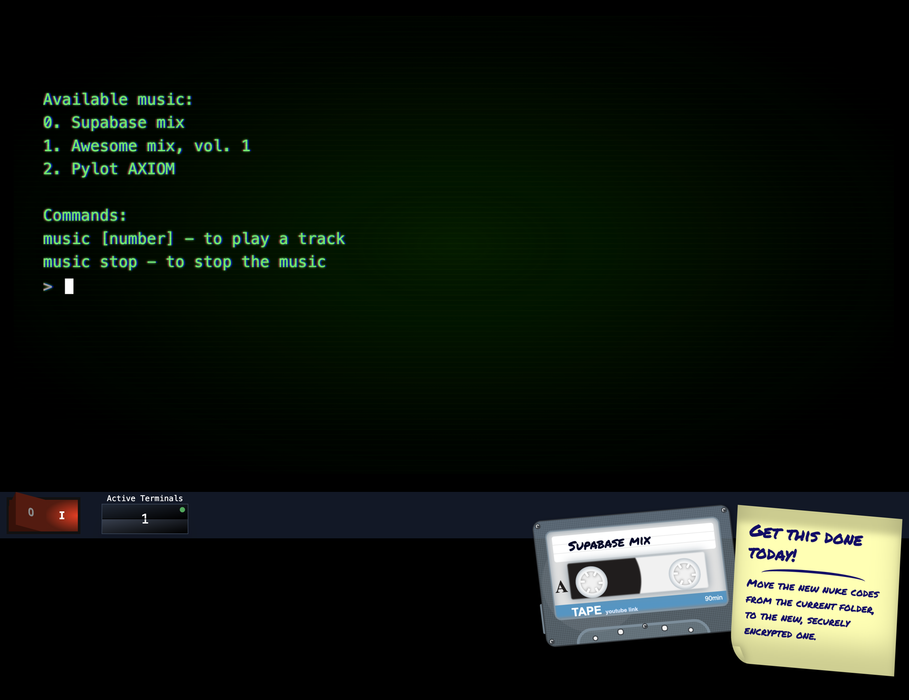

# Defeat the hacker from the future

The year is 1982.  You're a computer programmer working for an agency that has
access to all the world's secrets.  Your terminal is the single most important
terminal in the world.  You must protect it from anyone.



**[WATCH A DEMO](https://youtu.be/lnbT52qf7SU)**

**[IN-DEPTH EXPLANATION](https://youtu.be/s23zCSZBuw8)**

**[PLAY THE GAME](https://1982vsthefuture.vercel.app/)**

## How to play

`help` Alway is a good idea.  Besides that, make sure you get done what you
have to get done!  I'll leave it at that and you can explore the rest...

> HINT: You can use free-form text to express the type of commands you want to do but the more
> accurate and specific commands or scripts you do, will give you a better chance of success.

> HINT: If you are having a hard time with the opponent, there's a secret command that can help you out...which you can find on Supabase's local setup "getting started".

### OpenAI Key Required

**IMPORTANT** - You will need an OpenAI API key to play this game and access
to the gpt-4-1106-preview model.

You can run `settings openai [key here]` to set it.

## Supabase Winter Hackathon 2023 Entry

This game was created for the Supabase Winter Hackathon 2023.  Some elements this uses:

- Supabase Postgres
- pg_vector
- Supabase Auth
- Supabase Realtime
- OpenAI (Both to drive the game and to generate embeddings)

---

## Running this yourself

If you want to try to run this yourself, there's a few things to note:

- You'll need a Supabase instance
- You'll need an OpenAI API key with access to the gpt-4-1106-preview model
- You'll need an .env.local file (see below)
- You'll want a connection string for your db, because of how I use it in the API files. This is set in the `DATABASE_URL` env var.

### .env.local

```bash
NEXT_PUBLIC_SUPABASE_URL=...
NEXT_PUBLIC_SUPABASE_ANON_KEY=...
DATABASE_URL=...
OPENAI_API_KEY=...
```

### DB extensions

Make sure to enable the pg_vector extension in your Supabase instance.

### Auth

Make sure to enable email auth in your Supabase instance.

### DB dump

I did a DB dump of the structure which you can find in `db.sql`.  You can use this to create the tables and functions (NOTE: I haven't tested re-initiating a new environment but at least it gives you a roadmap).  It doesn't look like a dump gives you the RLS rules so you'll have to create those yourself.  They're basically the "user management" RLS template from Supabase but also those same rules applied for the "round" table as well.

### There's a hard coded auth token reference that needs to change

I'm fairly certain this is not what you're supposed to do but I ran in to a road block and could
not figure it out in any meaningful amount of time.  Search `sb-aqpsyixuuqiflmvbnykl-auth-token` and
you'll see those instances.  I believe you can replace them with your Supabase instance's auth token key identifier and it will work.  The docs seem to indicate all of this should be handled via
cookies, but the AuthUI component (or something) is not setting those and I didn't have time in the hackathon to figure out why.

There is a Discord thread I started about this issue [here](https://discord.com/channels/839993398554656828/1185407818900185089).

## Credits

As with any hackathon, there's a lot of code or libraries thrown at the wall while
working at blistering speeds to get things done.  Here's a non-comprehensive list (besides package.json of course):

### Music

The super cool music you can play comes from these YouTube videos:
(The youtube videos are embedded in the game in case you're wondering)

- <https://www.youtube.com/watch?v=r1POD-IdG-I>
- <https://www.youtube.com/watch?v=TB_hcHcmorc>
- <https://www.youtube.com/watch?v=Kt-tLuszKBA>

### Terminal ideas, inspiration, etc

- <https://www.sillyui.com/docs/floating-pc>
- <https://hackernoon.com/creating-a-terminal-emulator-in-react>
- <https://github.com/jonmbake/react-terminal-ui>
- <https://www.tohodo.com/#projects>
- <https://github.com/Swordfish90/cool-retro-term>
- <https://dev.to/ekeijl/retro-crt-terminal-screen-in-css-js-4afh>
- <https://www.youtube.com/watch?v=jDJHtLCHuAg>
- <https://chafalleiro.github.io/retromator/index.html>
- <https://github.com/custom-start-page/retro-crt>
- <https://scar45.github.io/retro-crt-startpage/index.html>
  - <https://github.com/scar45/retro-crt-startpage>
  - <https://codepen.io/lbebber/pen/XJRdrV>
  - <https://codepen.io/meduzen/pen/zxbwRV>
  - <https://codepen.io/kristarling/pen/WwPovb>
- <https://codepen.io/marcusconnor/pen/QJNvMa>

### Cassette Tape

 <https://tympanus.net/codrops/2012/07/12/old-school-cassette-player-with-html5-audio/>


### The "win" state of the game

<https://codepen.io/rblalock/pen/qBgwpdz>

### The pitch video inspiration

<https://int10h.org/blog/2021/01/simulating-crt-monitors-ffmpeg-pt-1-color/>

<https://ffmpeg.lav.io/>

<https://chafalleiro.github.io/retromator/videomator.html>

